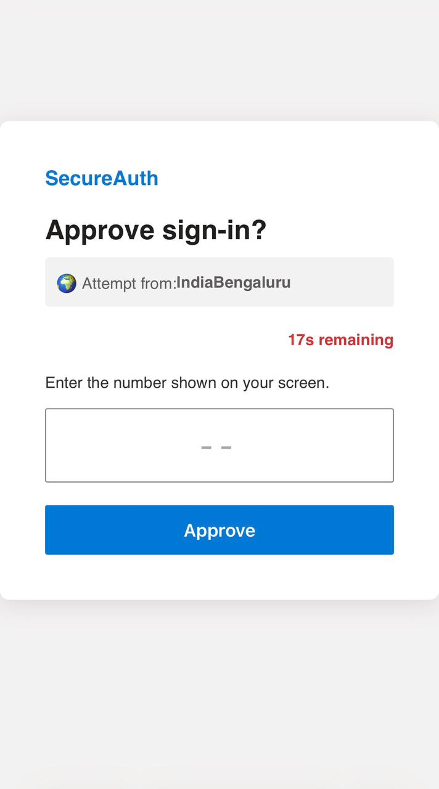
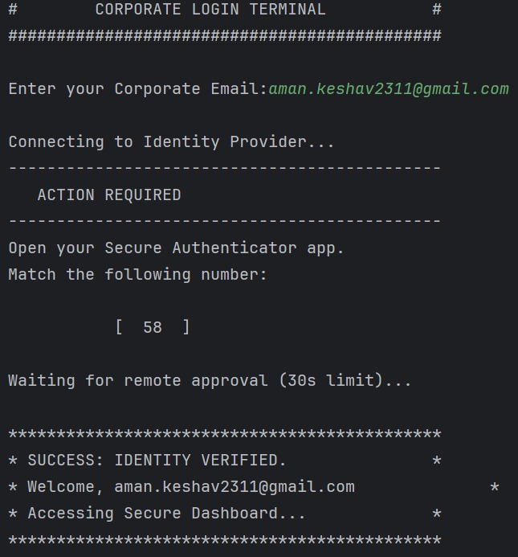
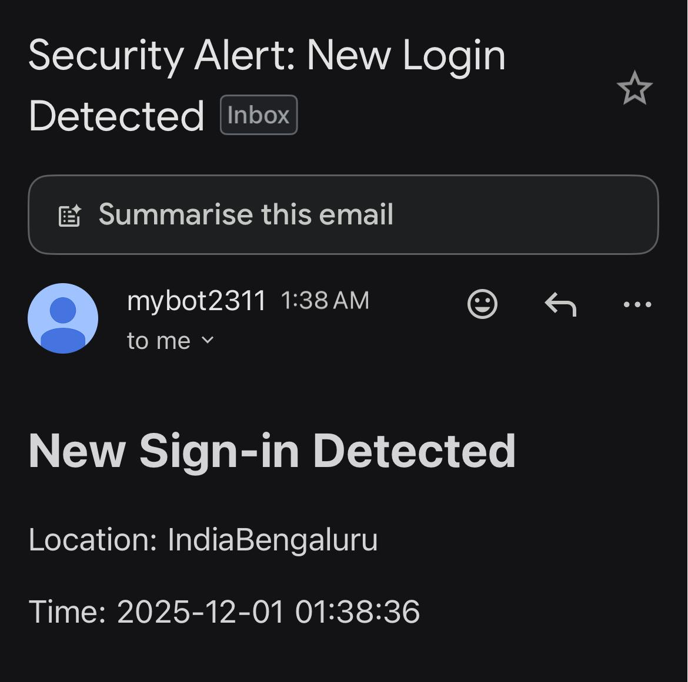
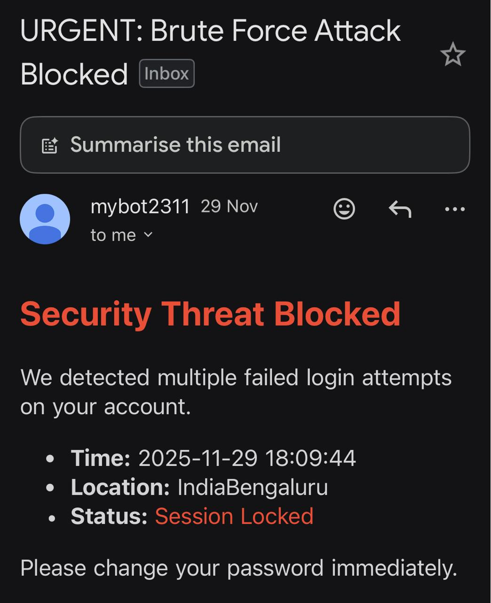
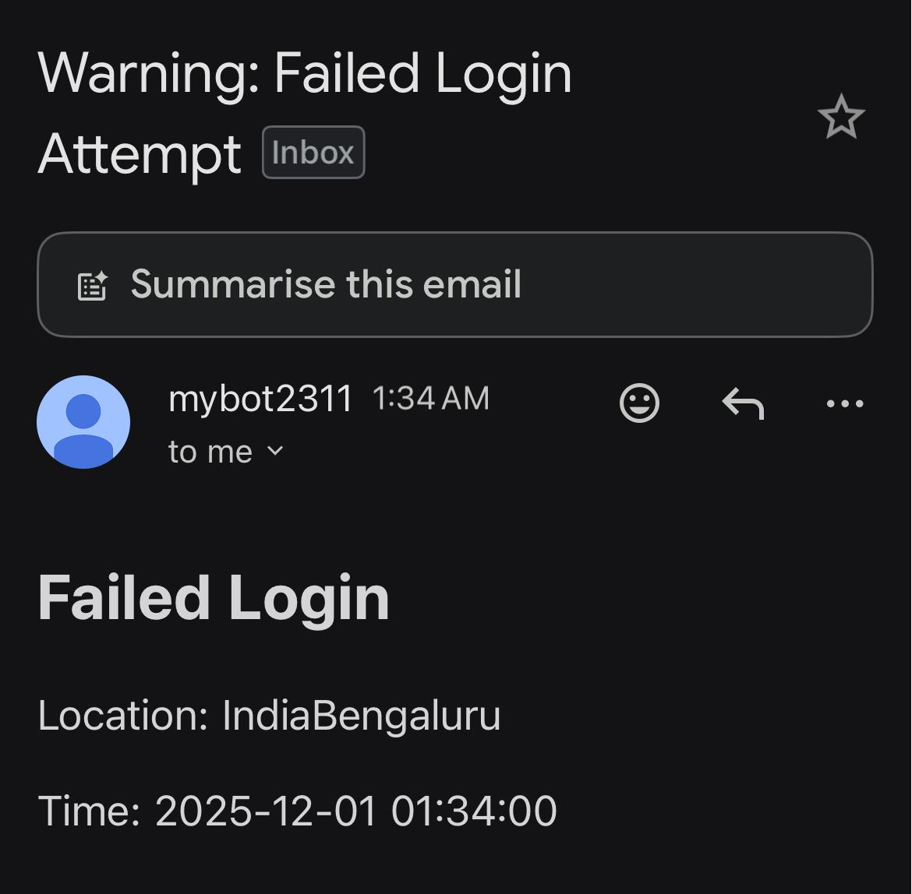

Secure 2FA Authenticator System

A production-grade, multi-threaded authentication system built in C++ that simulates enterprise identity providers like Microsoft Authenticator. This project demonstrates low-level systems programming, custom cryptography, and hybrid-language architecture (C++ Core + Python Microservices).

📸 Project Screenshots

1. Mobile Authenticator Interface

Responsive web interface served directly by the C++ socket server, featuring live session timers and location detection.

2. Desktop Client & Server Console

The secure handshake process: Client requesting access (Left) and Server handling the transaction (Right).

3. Email Security Alerts

Automated transactional emails triggered by the Python microservice for different security events.

Scenario A: Successful Login

Scenario B: Brute Force Blocked (Critical)

Scenario C: Session Timeout Warning

🚀 Key Features

Multi-Threaded Server Architecture: Simultaneously handles TCP connections (Desktop Client) and HTTP requests (Mobile Web Interface) using std::thread and non-blocking sockets.

Custom Cryptography Engine: Manual implementation of SHA-256 hashing to generate tamper-proof audit logs for every session—no external crypto libraries used.

Zero-Dependency Web Server: Serves a modern, responsive HTML5/CSS3/JS interface to mobile devices using raw C++ sockets.

Geo-Location Security: Integrates with IP-API to detect and display the login attempt's real-world location (City/Country) on the authenticator device.

Microservice Email Relay: Utilizes a Python subsystem to handle transactional email alerts (SMTP) for successful logins or brute-force warnings.

Brute-Force Protection: Automatically locks sessions after 3 failed attempts and triggers critical security alerts.

🛠️ System Architecture

The system follows a distributed micro-architecture pattern:

AuthServer (The Core): A C++ backend listening on two ports:

Port 8080 (TCP): Handles secure communication with the Desktop Client.

Port 8081 (HTTP): Serves the authentication web app to the user's phone.

UserClient (The Terminal): A C++ client simulating a corporate login terminal. It establishes a secure handshake and waits for out-of-band verification.

Authenticator (The Mobile Interface): A responsive web app running on the user's phone that acts as the physical security key.

Notification Service: A Python script triggered by the C++ core via std::system to dispatch emails via Gmail SMTP.

💻 Tech Stack

Core Language: C++ 20 (Smart Pointers, Atomics, Threads)

Networking: Windows Sockets API (Winsock2)

Build System: CMake

Scripting: Python 3 (SMTP Relay)

Frontend: HTML5, CSS3 (Glassmorphism UI), JavaScript

⚙️ Setup & Installation

1. Prerequisites

C++ Compiler: MinGW or MSVC (Supporting C++17/20).

Python 3: Installed and added to system PATH.

CMake: For building the project.

2. Configuration (Security)

This project uses Environment Segregation to protect credentials.

Create a file named secrets.py in the project root.

Add your Gmail App Password (NOT your login password):

SENDER_EMAIL = "your-bot-email@gmail.com"
SENDER_PASSWORD = "your-16-char-app-password"

Note: secrets.py is git-ignored for security.

3. Build & Run

# Build using CMake
mkdir build
cd build
cmake ..
cmake --build .

# Run the Server first
./AuthServer

# Run the Client in a separate terminal
./UserClient

📊 Performance Metrics

Memory Footprint: < 3MB (Highly efficient resource management).

Latency: < 15ms for local network handshake.

Throughput: Capable of handling concurrent flows via multi-threading.

🛡️ Security Implementation Details

SHA-256: Implemented from scratch (bitwise rotation/padding) to verify session integrity.

Timeouts: Sessions have a strict 30-second Time-To-Live (TTL) to prevent zombie connections.

Audit Logging: Every successful or failed attempt creates an immutable log entry.

Built by Aman Keshav Prasad.
